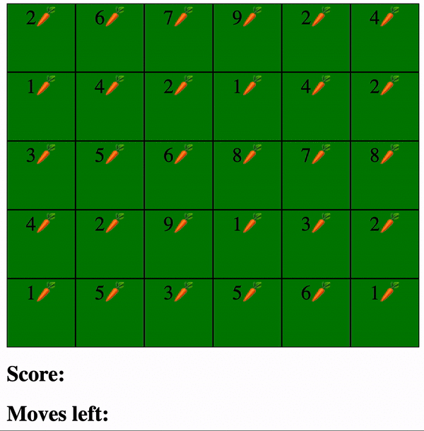

# Hungry Rabbit
Provided a 2D matrix and a number of rounds the bunny might eat, the hungry rabbit will 'eat' all carrots in the matrix and leave nothing behind!

## Constraints I worked with
1. The bunny can traverse the 2D matrix with four moves: up, down, left or right.
2. The bunny must be placed at the exact center of the provided 2D matrix, independent of its size.
3. The bunny must choose his next spot based on how many carrots are available for him to eat, he should choose the spot that has more carrots to offer.
4. The bunny will receive a number of rounds he can traverse the matrix, he must not move if there are no moves left. 

